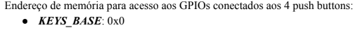
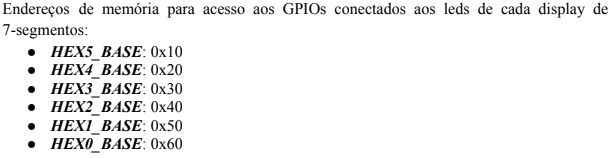
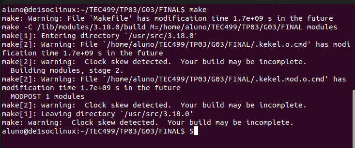
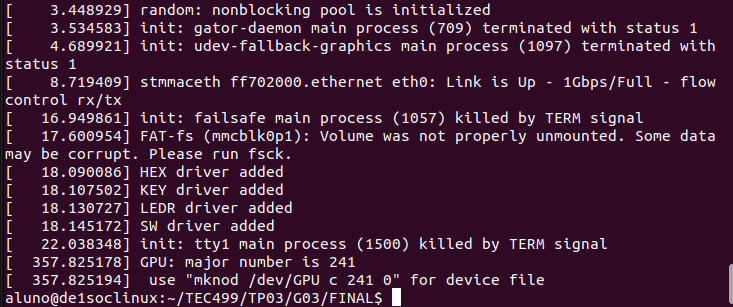
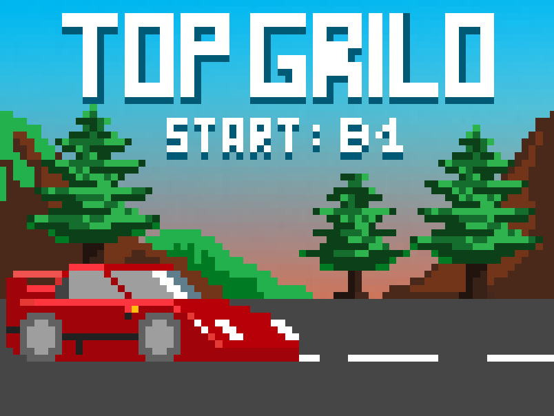
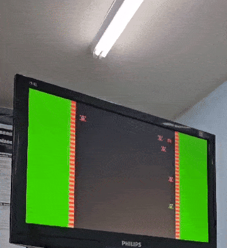

# Sistemas-Digitais
Conteúdo desenvolvido durante a matéria de PBL de Sistemas Digitais.

> Grupo: 
> - Humberto Bandeira Costa
> - João Victor Alves Cerqueira
> - Júlia Carneiro Gonçalves de Souza
> - Thiago Souza Rodrigues.

# Introdução

O ex-aluno do curso de Engenharia de Computação na UEFS (Universidade Estadual de Feira de Santana) Gabriel Sá Barreto Alves, durante suas atividades de iniciação científica e em seu trabalho de conclusão de curso, projetou e implementou uma GPU capaz de mover e controlar elementos em um monitor VGA com resolução de 640x480 pixels. Esse processador foi projetado para desenhar dois tipos de polígonos convexos (quadrado e triângulo), além de editar, criar e manipular uma quantidade determinada de sprites. Para realizar essas tarefas, Gabriel utilizou o NIOS II como unidade de processamento principal, que foi embarcada na mesma FPGA que o Processador Gráfico.

Utilizando esse dispostivo, utilizamos uma biblioteca que foi devolvida para tornar mais intuitivo o uso das instruções e conseguir traduzir os dados enviados do modo de usuário para o modo de Kernel de modo que a GPU seja capaz de executá-las. 
Com o intuito de aplicar a biblioteca, neste projeto criamos um jogo chamdo "Top Grilo", que é um jogo de ação com carros onde o jogador deve desviar e atirar em outros carros para receber uma pontuação, além disso, é preciso manter o tanque cheio - o jogador vai perdendo gasolina ao longo do tempo e precisa repor - caso acabe a gasolina ou seja atingido 3 vezes por um carro, o jogador perde. Outra coisa interessante é o aumento de dificuldade gradual - com o passar o tempo, a velocidade que os carros inimigos são gerados é aumentada e fica cada vez mais dificil se manter vivo!

# Como jogar?
O jogador controla o movimento do carro com o mouse, podendo andar para qualquer direção dentro da pista. 
- Inicia/Reiniciar: Push Button da placa - B0
- Atirar: Click esquerdo do mouse
- Pausar: Push Button da placa - B1

# Requisitos do projeto

1. ✅ O código deve ser escrito em linguagem C 
2. ✅ O sistema só poderá utilizar os componentes disponíveis na placa 
3. ✅ Um novo sprite deve ser colocado na memória e utilizado no jogo 
4. ✅ As ações do ator do jogo (pulo, tiro, etc.) devem ser comandadas pelos botões do mouse 
5. ✅ A variação da velocidade no movimento do mouse deve ser refletida na ação do ator do jogo. Por exemplo, no jogo breakout a barra se move com velocidade maior se o movimento do mouse for brusco 
6. ✅ Informações do jogo (placar, vidas, etc.) devem ser exibidas no display de 7-segmentos 
7. ✅ O jogo deve permitir ações do usuário através dos botões da DE1-SoC, no mínimo: a pausa, o retorno, o reinício e o término do jogo. 
8. ✅ O usuário poderá parar e reiniciar o jogo em qualquer momento 
9. O usuário poderá sair do jogo em qualquer momento. 
10. ✅ Pelo menos um elemento passivo do jogo deverá se mover. 

# Metodologia
Este tópico trata sobre os passos e questionamentos que enfrentamos durante o desenvolvimento do projeto. 

### Ferramentas utilizadas:
* Kit FPGA DE1-SoC
* Visual Studio Code para desenvolvimento do código em C
* Processador Gráfico (GPU) desenvolvido por Gabriel Sá Barreto Alves
* Monitor
* Cabo VGA para conexão
* Mouse

### 1\. Início do projeto

* Iniciamos o projeto implementando a movimentação do mouse
* Desenvolvemos a geração de inimigos na tela.
* Adicionamos a ação do player - o tiro com o click esquerdo do mouse.

Com essas duas mecânicas, a base do projeto estava feita e a interface e cenário começaram a ser desenvolvidas.

### 2\. Análise do projeto a nível de hardware:

* Como utilizar o display de 7-segmentos para pontuação e vida?
* Como utilizar os push-buttons para pause e início do jogo?
* Como capturar as coordenadas e ações do mouse?
* Como implementar o jogo de forma que 

### 3\. Desenvolvimento do código

Para o desenvolvimento do jogo, foi necessário inicialmente descobrir como capturar a movimentação do mouse. Para isso, utilizamos a biblioteca linux/input.h, que nos permitiu identificar tanto o movimento do mouse quanto as ações de clique. Por ser um jogo, é fundamental que o movimento do mouse seja capturado continuamente. Para atender a essa necessidade, utilizamos uma thread dedicada a capturar as ações do mouse em tempo integral.

A partir das entradas das ações do mouse, implementamos diversas funcionalidades. Uma delas é a movimentação de uma sprite baseada no movimento do mouse. Esta sprite representa um carro, que é o elemento ativo do jogo. Este carro pode realizar uma ação: atirar. Para implementar essa ação, utilizamos uma sprite que representa um tiro. Quando o botão direito do mouse é clicado, a sprite do tiro é gerada na parte superior do carro e se move em linha reta, subindo pela tela até colidir com outra sprite ou atingir o fim da tela.

O jogo também possui elementos passivos, que podem ser de dois tipos: carros inimigos ou combustível (gasolina). Esses elementos são representados por sprites; os carros são sprites fornecidas pela própria GPU, enquanto a gasolina é uma sprite criada a partir da instrução WSM. Ambos os elementos podem colidir com o elemento ativo (o carro) ou com o tiro. Se um carro inimigo colidir com o carro do jogador, uma vida é decrementada. Se o tiro colidir com um inimigo, um ponto é adicionado, e se colidir com a gasolina, ela é destruída.

### 4\. Ajustes

* Verificar jogabilidade do jogo.
* Testes e correções no funcionamento do código.

# Descrição do Projeto

Como já explicado na introdução, os pontos principais do jogo são:
- É um jogo de ação
- Jogador deve evitar colisões com carros
- Atire em inimigos para ganhar pontuação
- Caso perca 3 vidas, o jogo acaba.
- Aumento de dificuldade gradual

## Instruções da GPU

### Escrita no Banco de Registradores (WBR):
Essa instrução é responsável por configurar os registradores que armazenam as informações dos sprites e a cor base do background. Foi utilizada para criar a cor cinza da pista no cenário jogo.

### Escrita na Memória de Sprites (WSM):
Essa instrução armazena ou modifica o conteúdo presente na Memória de Sprites. O campo opcode é semelhante a instrução anterior, no entanto, seu valor é configurado em 0001. O campo endereço  de memória  ́ especifica qual local da memória será alterado. Os campos R, G e B definem as novas componentes RGB para o local desejado.
Com esta instrução, acrescentamos o sprite de gasolina - um item que pode ser coletado pelo jogador. 

### Escrita na Memória de Background (WBM):
Essa instrução armazena ou modifica o conteúdo presente na Memória de Background. Sua função é configurar valores RGB para o preenchimento de áreas do background. Seus campos são semelhantes ao da instrução WSM a única diferença está no campo de  endereço de memória  com tamanho de 12 bits. O background é dividido em pequenos blocos de 8x8 pixels e cada endereço de memória corresponde a um bloco. Sendo a resolução de 640x480 pixels, temos uma divisão de 80x60 blocos. 
Com isto fomos capazes de criar as telas de início, pause e game over - cada pixel do desenho foi traduzido como código RGB e utilizado pela instrução. 

## Push Buttons

Para possibilitar a interação com os botões, foi necessário acessar diretamente os registradores de hardware que os controlam. Portanto, deve existir um mecanismo que transforme os endereços virtuais em endereços reais. Esse mecanismo, conhecido por mapeamento, permite traduzir um endereço localizado no espaço virtual para um associado no espaço real. Como consequência do mapeamento, um programa não mais precisa estar necessariamente em endereços contíguos na memória principal para ser executado. Fazemos isso através do dispositivo /dev/mem no Linux, que permite mapeamento de memória física para o espaço de endereçamento virtual do processo. 

Assim, foram definidas constantes para a base da ponte lightweight, a extensão e o offset dos botões com base na documentação de endereçamento da GPU fornecida pelo professor e desenvolvido no código uma função responsável por acessar à memória, monitorar os botões e alterar as variáveis “iniciou” e “parar” responsáveis pelo controle do jogo.

    

  

## Display 7-segmentos

Para configuração e utilização do display de 7-segmentos também se fez necessário realizar o processo de mapeamento de memória assim como feito nos push-buttons. Além disso, foi preciso a criação de uma função para decodificar números decimais em seu equivalente binário para o tipo de display usado.

    

  

# Como rodar o jogo?

1\. Faça download dos arquivos no Kit FPGA DE1-SoC que já tenha a GPU previamente configurada. 

2\. Abra um terminal remoto na pasta que você colocou os arquivos. 

3\. Digite o comando 'make'
* Atenção! É possível que na primeira vez que você rode o código apareça esse aviso:

    

  

* Para resolver isso e garantir que a build esteja completa, é só executar 'sudo date [mês][data][hora][minutos][ano]' (substitua pelas informações do dia que estiver testando) e rode o 'make' novamente.

4\. Na primeira vez que executar o código, você precisará inserir o módulo kernel criado com a linha de comando 'sudo insmod kekel.ko'. 

5\. Agora vamos criar o arquivo 'GPU': 
* Digite 'dmesg' para conseguir ver as mensagens de retorno do módulo kernel, lá vamos encontrar a linha de comando necessária para criar o arquivo!

    

* Foque nas últimas mensagens e copie o comando de código que for fornecido - que segue este modelo: "mknod /dev/GPU c [major number] 0" 

6\. Com o arquivo criado, já podemos compilar a main do projeto com o comando - 'gcc main.c -c main -std=c99 -lpthread'

7\. Agora, rode o executável com 'sudo ./main'
* Ao iniciar, essa tela teve aparecer:
  

    

# Testes

* Ao longo do projeto diversos testes foram executados.
* Os principais testes foram relacionados a colisão e jogabilidade do jogo. Além disso, também nos preocupamos com o funcionamento correto das telas. 

    

* O cálculo que fizemos para conseguir adicionar colisão no nosso código:

    

# Resultados e Conclusão:

O resultado do trabalho desenvolvido é um jogo simples e funcional, com boa jogabilidade. 
A respeitos dos requisitos esperados para este projeto, todos foram alcançados com exceção do botão de saída do jogo. 
O desenvolvimento desse projeto foi muito importante para juntar e assimilar todos os desafios dos PBLs anteriores e com isso fomos capazes de implementar um produto do início ao fim, aproveitando recursos que desenvolvemos anteriormente.

# Possíveis melhorias:

- Mostrar vida na tela, similar a gasolina.
- Adicionar trilha e efeitos sonoros.
- Trazer upgrades e habilidades diferentes para o player.
- Fazer otimizações para melhorar desempenho do jogo.

# Referências:

Intel FPGA - Linux On DE Series Boards. Disponível em: [Linux_On_DE_Series_Boards](https://ftp.intel.com/Public/Pub/fpgaup/pub/Intel_Material/17.0/Tutorials/Linux_On_DE_Series_Boards.pdf). Acesso em: 10 jun. 2024

Linux Kernel Module Programming - SolidusCode. Disponível em: https://www.youtube.com/playlist?list=PL16941B715F5507C5. Acesso em: 10 jun. 2024.

Alves, Gabriel Barreto; Dias, Anfranserai M.; Sarinho, Victor T. Desenvolvimento de uma Arquitetura Baseada em Sprites para criação de Jogos 2D em Ambientes Reconfiguraveis utilizando dispositivos FPGA. Feira de Santana, Ba: 2023.‌ 
Disponível em: https://drive.google.com/file/d/1MlIlpB9TSnoPGEMkocr36EH9-CFz8psO/view. Acesso em: 14 jun. 2024.

Memória Virtual: Mapeamento. Disponível em: <https://memoriavirtualunisc.blogspot.com/p/mapeamento.html>.

--

