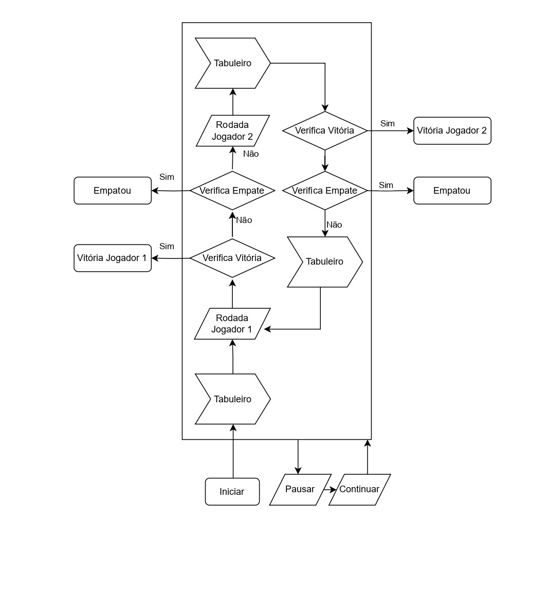
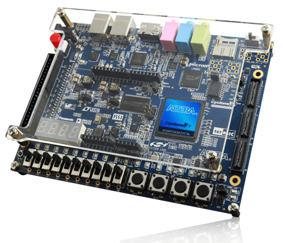
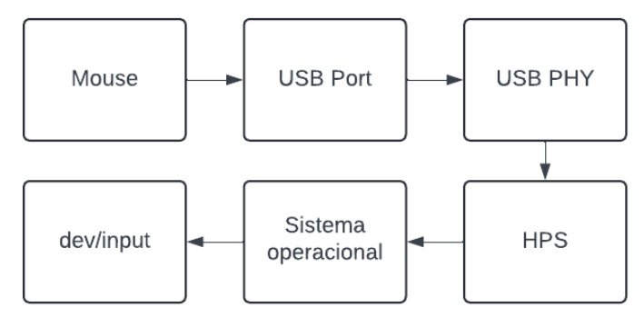
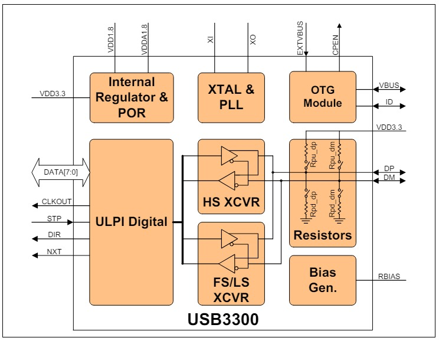
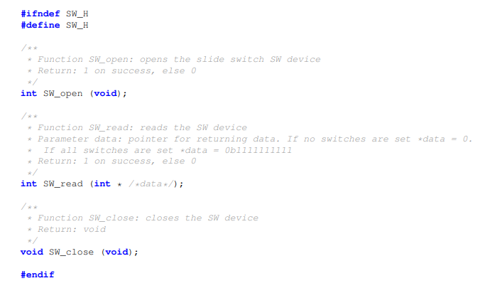

# Sistemas-Digitais
Conteúdo desenvolvido durante a matéria de PBL de Sistemas Digitais.

> Grupo: 
> - Humberto Bandeira Costa
> - João Victor Alves Cerqueira
> - Júlia Carneiro Gonçalves de Souza
> - Thiago Souza Rodrigues.

# Introdução

A indústria de jogos digitais tem sido um motor do entretenimento, impulsionando a inovação e criatividade ao longo dos anos. Com avanços tecnológicos contínuos, os jogos de última geração continuam a oferecer experiências imersivas e visualmente deslumbrantes para os jogadores. No entanto, mesmo com todos esses avanços, há uma tendência notável em direção aos jogos clássicos que resistiram ao teste do tempo.

Um exemplo notável é o jogo da velha (tic-tac-toe), que mantém sua popularidade ao longo das décadas devido à sua simplicidade e jogabilidade atemporal. Apesar da era digital, este jogo de estratégia simples continua a atrair jogadores de todas as idades, oferecendo uma experiência de entretenimento simples, mas envolvente.

Diante desse contexto, surge a necessidade de desenvolver uma versão do jogo da velha que possa ser executada em um console com uma interface em modo texto, acessível através de um terminal. Esta versão do jogo deve permitir a interação de dois jogadores, com a escolha da posição de marcação no tabuleiro sendo feita através de um mouse conectado a uma porta USB. Além disso, a placa de desenvolvimento DE1-SoC que vai ser utilizada oferece recursos adicionais, como botões, chaves, LEDs e displays 7-segmentos, que podem ser utilizados para aprimorar a experiência do usuário e fornecer informações adicionais durante o jogo.

Neste projeto, os estudantes de computação da Universidade Estadual de Feira de Santana (UEFS) estão encarregados do desenvolvimento do jogo da velha. Os estudantes têm a tarefa de unir a simplicidade atemporal do jogo da velha com a tecnologia moderna, proporcionando uma experiência de jogo que seja ao mesmo tempo nostálgica e inovadora.

Metodologia

Ferramentas utilizadas:

* Kit FPGA DE1-SoC
* Visual Studio Code para desenvolvimento do código em C
* Mouse com conexão USB
* Switches do kit

1. Início do projeto
* Fluxograma do jogo

2\. Análise do projeto a nível de hardware:

* Como integrar a lógica e código do jogo ao Kit FPGA DE1-SoC?
* Funcionamento do Mouse
* Periféricos do FPGA (Switches)

3\. Desenvolvimento do código e integração com placa

* Criação das funções essenciais
* Imprimir tabuleiro
* Capturar movimento
* Efetuar jogada
* Verificar vencedor
* Pause/Resume

4\. Ajustes

* Testes e correções no funcionamento do código

Imagem : Fluxograma do Jogo

O periférico utilizado para o desenvolvimento desse projeto foi a porta USB, para conexão e uso de um mouse que recebe o movimento dos jogadores.

Descrição do Projeto

Placa DE1-SOC

Conforme discutido nas seções anteriores, o projeto fez uso do kit de desenvolvimento DE1-SOC, que inclui um processador ARM Cortex-A9 dual-core. Este processador é responsável pela execução do sistema operacional Linux e de outras aplicações de software na placa. Além disso, o kit conta com uma FPGA da família Intel Cyclone V, que possui diversos periféricos, como switches e portas USB, os quais foram utilizados no projeto.

Ao compilar e executar um programa escrito em C, o processamento ocorre no processador ARM. No entanto, para acessar os periféricos presentes na FPGA, é necessário que o processador se comunique continuamente com a FPGA. Essa comunicação é realizada geralmente por meio de interfaces específicas, como bridges HPS-to-FPGA.

Imagem : Kit de desenvolvimento DE1-SOC

Mouse

Sendo assim, é preciso entender como ter acesso às informações do mouse conectado à porta USB do kit.

Imagem :

Um mouse é composto por um sensor óptico (ou laser), botões e uma placa de circuito. Quando movido, o sensor detecta o movimento e envia sinais elétricos para a placa de circuito. Esses sinais são transmitidos para o computador através de um cabo USB ou sem fio, utilizando tecnologias como Bluetooth ou RF (Radio Frequência). O USB PHY seria um circuito lógico/controlador USB que segue essa arquitetura:

Imagem :

Conforme ilustrado na figura anterior, depois dos sinais elétricos passarem pelos resistores e circuitos lógicos, o ULPI Digital envia os dados digitais pelo barramento DATA para o HPS do Kit. . A seguir, o HPS interpreta e envia as informações para o driver do mouse que está no kernel, que no caso do Linux, armazenam-as em um arquivo localizado em dev/input/mice.

Observando o arquivo dev/input/mice por meio do comando cat percebemos que o terminal permanece vazio até que nós movemos o ponteiro do mouse. Ao mexer o ponteiro obtemos uma saída praticamente sem significado, isso porque o arquivo nos retorna um conteúdo em binário. Para observarmos melhor podemos utilizar o comando od para torná-lo mais legível. Interpretando esse conteúdo podemos perceber que ele é constituído por 3 bytes. Por meio do primeiro byte podemos capturar os cliques do mouse onde o primeiro bit menos significativo do primeiro byte representa o clique esquerdo, o segundo bit o clique direito e o terceiro bit o clique no scroll. Já no segundo byte podemos capturar o movimento no eixo X, assim como no terceiro byte o movimento no eixo Y.

Imagem  : Saída do arquivo mice aberto com comando cat.

Imagem  : Saída do arquivo mice aberto com comando cat junto ao comando od.

Com os dados do mouse já interpretados, através da linguagem C foram utilizadas as bibliotecas fcntl e unistd que foram utilizadas para abrir/fechar o arquivo e ler as informações do arquivo, respectivamente.

Switches

Além do mouse, foram utilizados periféricos conectados à FPGA da placa, os switches. Quando um deles é ativado, ocorre uma mudança no estado dos pinos da FPGA e, através do driver, esses dados são salvos em um arquivo localizado em IntelFPGAUP/SW.

Dentro do arquivo SW.h existem funções wrapper que possibilitam acessar os dados que indicam o estado do switch (ligado/desligado). Utilizando a função SW\_read, foi possível acessar os dados provenientes do switch e implementar a funcionalidade de pausar o jogo. Assim, quando o switch está para cima, o jogo está pausado, e quando está para baixo, o jogo está em curso. É válido ressaltar que a função de pausar o jogo foi feita utilizando Threads, para que acontecesse de maneira assíncrona com o jogo.

Imagem : Documentação das funções para uso

dos Switches na linguagem C

Resultados e Conclusão:

O resultado do trabalho desenvolvido é um programa que permite interação com o hardware do kit FPGA DE1-SoC. Este programa atende às especificações solicitadas, incluindo o desenvolvimento em linguagem C, a utilização exclusiva de recursos disponíveis no kit, a interação de dois jogadores, a captura das jogadas pelo mouse e as opções de iniciar, pausar e continuar o jogo.

Através do desenvolvimento do programa, foi possível aplicar conhecimentos de interação hardware-software, compreender as políticas de gerenciamento do sistema operacional Linux em arquitetura ARM, entender os princípios básicos da arquitetura da plataforma DE1-SoC, além de diversos outros conceitos importantes para o processo de aprendizagem.

Possíveis melhorias:

Existem algumas melhorias que podem ser implementadas no programa desenvolvido. Uma possibilidade é utilizar mais recursos do kit, como o mostrador de 7 segmentos, para exibir a pontuação dos jogadores e indicar qual jogador está na vez de efetuar a jogada. Além disso, pode-se aprimorar a movimentação do mouse na tela para torná-la mais suave e melhorar a parte visual do jogo para proporcionar uma experiência mais agradável e intuitiva para o usuário.

Em termos de jogabilidade, uma melhoria possível ao iniciar a partida seria a opção de jogar com dois mouses. Isso permitiria que cada jogador tivesse seu próprio controle durante o jogo, ao contrário da configuração atual, na qual ambos compartilham o mesmo mouse. Essa mudança poderia aumentar a sensação de controle e tornar a experiência mais dinâmica e envolvente para os jogadores.

https://ww1.microchip.com/downloads/aemDocuments/documents/OTH/ProductDocuments/DataSheets/00001783C.pdf

https://www.baeldung.com/linux/mouse-events-input-event-interface
