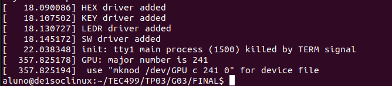

# Sistemas-Digitais
Conteúdo desenvolvido durante a matéria de PBL de Sistemas Digitais.

> Grupo: 
> - Humberto Bandeira Costa
> - João Victor Alves Cerqueira
> - Júlia Carneiro Gonçalves de Souza
> - Thiago Souza Rodrigues.

# Introdução
As GPUs (Unidades de Processamento Gráfico) desempenham um papel fundamental em sistemas de computação gráfica, sendo projetadas para lidar com operações de computação gráfica e processamento de imagens de maneira eficiente. 

O ex-aluno do curso de Engenharia de Computação na UEFS (Universidade Estadual de Feira de Santana) Gabriel Sá Barreto Alves, durante suas atividades de iniciação científica e em seu trabalho de conclusão de curso, projetou e implementou uma GPU capaz de mover e controlar elementos em um monitor VGA com resolução de 640x480 pixels. Esse processador foi projetado para desenhar dois tipos de polígonos convexos (quadrado e triângulo) e manipular uma quantidade determinada de sprites. Para realizar essas tarefas, Gabriel utilizou o NIOS II como unidade de processamento principal, que foi embarcada na mesma FPGA que o Processador Gráfico.

No entanto, a plataforma DE1-SoC, utilizada nesse projeto, possui um processador ARM (HPS) que elimina a necessidade do NIOS II. Essa mudança trouxe um novo desafio: Como o HPS irá se comunicar com o processador gráfico que está na FPGA? A solução para esse problema envolve a criação de um módulo de Kernel no HPS para permitir a comunicação eficiente com o processador gráfico. 

Neste projeto, os estudantes de Engenharia de Computação da matéria Sistemas Digitais estão encarregados de desenvolver tanto o módulo de Kernel garantindo que o HPS possa gerenciar o Processador Gráfico de maneira eficaz. Além disso, será necessário desenvolver uma biblioteca em C que contenha funções para cada instrução existente na GPU.


# Metodologia

### Ferramentas utilizadas:
* Kit FPGA DE1-SoC
* Visual Studio Code para desenvolvimento do código em C
* Processador Gráfico (GPU) desenvolvido por Gabriel Sá Barreto Alves
* Monitor
* Cabo VGA para conexão


### 1\. Início do projeto

* Tabela das instruções da GPU.
* Código em C para escrever uma instrução.


### 2\. Análise do projeto a nível de hardware:

* O que é o Kernel?
* Como fazer um módulo do Kernel?
* Como fazer a comunicação do espaço do usuário com o Kernel?
* Como ocorre a passagem de dados do Kernel para a GPU?


### 3\. Desenvolvimento do código e integração com placa

* Desenvolvimento do módulo Kernel
* Criação da biblioteca de funções com cada Instrução do Processador Gráfico
* Desenvolvimento do código responsável pela geração do Driver do Processador Gráfico


### 4\. Ajustes

* Testes e correções no funcionamento do código

# Descrição do Projeto

## Processador Gráfico
<p align="center">
    
</p>

## Módulo Kernel 
Módulos Kernel surgem da necessidade de estender a funcionalidade do kernel do sistema operacional para suportar novos dispositivos ou fornecer novas funcionalidades. 
Assim, no contexto retratado, para realizar a comunicação entre o processador ARM (HPS) e a GPU embarcada na mesma FPGA é necessário o desenvolvimento desse módulo para o Linux. Além disso, para que essa comunicação seja realizada de maneira eficaz e segura entre o hardware e o sistema operacional, surge a necessidade de um driver de dispositivo, também essencial para a criação da biblioteca solicitada, abstraindo a complexidade na comunicação e apresentando uma interface de leitura/escrita padrão do Linux utilizada em qualquer comunicação hardware-software.

### Mapeamento de memória virtual

O processador apenas executa instruções e referencia dados residentes no espaço de endereçamento real; portanto, deve existir um mecanismo que transforme os endereços virtuais em endereços reais. Esse mecanismo, conhecido por mapeamento, permite traduzir um endereço localizado no espaço virtual para um associado no espaço real. Como conseqüência do mapeamento, um programa não mais precisa estar necessariamente em endereços contíguos na memória principal para ser executado.

<p align="center">
    
</p>

Utilizando como um documento de endereçamento da GPU fornecido pelo professor, foi desenvolvido um código em C responsável por ambas as funções, gerar o módulo Kernel e o Driver.

<p align="center">
    
</p>

<p align="center">
    
</p>

## Instruções da GPU
### Escrita no Banco de Registradores (WBR):
Essa instrução é responsável por configurar os registradores que armazenam as informações dos sprites e a cor base do background. Como essa cor base é armazenada no primeiro registrador do Banco, a instrução WBR segue a estrutura apresentada na figura abaixo, a primeira parte é referente a modificação da cor base do background, já a segunda parte é referente a adição de sprites à tela.

<p align="center">
    
</p>

### Escrita na Memória de Sprites (WSM):
Essa instrução armazena ou modifica o conteúdo presente na Memória de Sprites. O campo opcode é semelhante a instrução anterior, no entanto, seu valor é configurado em 0001. O campo endereço  de memória  ́ especifica qual local da memória será alterado. Os campos R, G e B definem as novas componentes RGB para o local desejado.

<p align="center">
    
</p>

### Escrita na Memória de Background (WBM):
Essa instrução armazena ou modifica o conteúdo presente na Memória de Background. Sua função é configurar valores RGB para o preenchimento de áreas do background. Seus campos são semelhantes ao da instrução WSM a única diferença  está no campo de  endereço de memória  com tamanho de 12 bits. O valor do opcode é configurado como 0010. O background é dividido em pequenos blocos de 8x8 pixels e cada endereço de memória corresponde a um bloco. Sendo a resolução de 640x480 pixels, temos uma divisão de 80x60 blocos. 

Isso permite que o background seja configurado de formas diferentes de acordo com o preenchimento da memória (Fig. 11). Se um endereço for preenchido com o valor 0b111111110 = 510, o Módulo de Desenho entenderá que o bloco correspondente está  desabilitado, assim ocupando os pixels da área com a cor base do background, um polígono ou sprite, caso suas coordenadas coincidam com o bloco.

<p align="center">
    
</p>

### Definição de um Polıgono (DP):
Essa instrução é utilizada para modificar o conteúdo da Memória de Instrução do Co-Processador (Fig. 6), de forma a definir os dados referentes a um polígono que deve ser renderizado. O valor do opcode é configurado como 0011. O campo endereço é utilizado para escolha da posição de memória em que a instrução será armazenada, possibilitando o controle da sobreposição dos polígonos. Os campos ref point X e ref point Y são usados para definir as coordenadas do ponto de referência do polígono. 

O campo tamanho define a dimensão do polígono. Caso seu valor seja configurado como 0b0000, logo, o polígono que foi definido estará desabilitado. 

Por último, as componentes RGB definem a cor do polígono, e o bit de forma define se o polígono corresponde a um quadrado = 0 ou triângulo = 1. 

<p align="center">
    
</p>

## Biblioteca 

Para que usuários consigam utilizar o código de maneira simples, uma biblioteca foi criada. 

Ela é responsável por enviar uma cadeia de bits referente as instruções que o usuário utilizar para o kernel. Sendo assim, um arquivo nomeado "GPU" foi criado para que a biblioteca escreva as informações e o kernel consiga ter acessa a elas. 


# Como utilizar?

1\. Faça download dos arquivos no Kit FPGA DE1-SoC que já tenha a GPU previamente configurada. 

2\. Abra um terminal remoto na pasta que você colocou os arquivos. 

3\. Digite o comando 'make'
* Atenção! É possível que na primeira vez que você rode o código apareça esse aviso:

<p align="center">
    
</p>  

* Para resolver isso e garantir que a build esteja completa, é só executar 'sudo date [mês][data][hora][minutos][ano]' (substitua pelas informações do dia que estiver testando) e rode o 'make' novamente.

4\. Na primeira vez que executar o código, você precisará inserir o módulo kernel criado com a linha de comando 'sudo insmod kekel.ko'. 

5\. Agora vamos criar o arquivo 'GPU': 
* Digite 'dmesg' para conseguir ver as mensagens de retorno do módulo kernel, lá vamos encontrar a linha de comando necessária para criar o arquivo!

<p align="center">
    
</p>

* Foque nas últimas mensagens e copie o comando de código que for fornecido - que segue este modelo: "mknod /dev/GPU c [major number] 0" 

6\. Com o arquivo criado, já podemos compilar a main do projeto com o comando - 'gcc main.c -c main -std=c99'

7\. Agora, rode o executável com 'sudo ./main'
* Se você estiver usando a main que disponibilizamos no projeto, essa imagem deve começar a se formar na tela: 

<p align="center">
    
</p>

* Por fim, lembre se de que você não precisa editar nenhum arquivo, apenas use um arquivo main.c que tenha "biblioteca.c" incluída e utilize as funções que disponibilizamos. Caso precise consultar, o arquivo da biblioteca está disponibilizado e comentado de forma que qualquer um consegue entender! :) 

# Testes

* Ao longo do projeto diversos testes foram executados.
* Uma das primeiras metas estabelecidas foi a criação do módulo kernel, e foram lá que os testes tiveram início. Inserindo uma cadeia de bits referente a uma instrução específica, conseguimos mostrar as primeiras imagens no monitor.
* Depois avançamos para a contrução da biblioteca, na tentativa de estabelecer uma conexão entre o espaço do usuário com o kernel.

Este é um exemplo de código de teste com instruções básicas: 

```C
#include "biblioteca.c"

int main(){
    //Testando background branco
    wbr01(7,7,7);

    //O bloco é definido a partir do endereço que você coloca.
    for(int i = 0; i <2000; i++) {
        wbm (0,0,7,1);
    }

    dp(1, 7, 0, 0, 0b0101, 320, 240, 0); // Triangulo vermelho
    dp (0, 0, 7, 0, 0b0011, 200, 250, 1); // Quadrado verde
    wbr02(100, 240, 4, 1, 6); //Sprite

    //Editando um sprite - desenhando um quadrado com duas cores
    for (int i = 1; i <= 200; i++) {
        wsm (0, 7, 0, i);
    for (int j = 200; j <= 400; j++) {
        wsm (7, 7, 0, j);
    }

    //Adiciona sprite editado na tela
    wbr02 (380, 40, 0, 1, 14);

    return 0;
}
```
Ele deve resultar na seguinte imagem:

<p align="center">
    
</p>

# Resultados e Conclusão:

O resultado do trabalho desenvolvido é um programa que permite interação entre hardware e software  através do kit FPGA DE1-SoC. Através do desenvolvimento desse programa foi possível aprender a respeito de mapeamento de memória em uma arquitetura ARM, como utilizar a interface de conexão entre HPs e o FPGA da DE1-SoCe e outros diversos assuntos e conceitos que foram utilizados durante o processo de criação do projeto.

A respeitos dos requisitos esperados para este projeto, todos foram alcançados, como, ter no mínimo uma função para cada instrução da GPU e a biblioteca seguir as recomendações que foram dadas. Por fim, o projeto final teve os resultados esperados e conseguiu atender aos requisitos que foram impostos.


# Possíveis melhorias:

Como possíveis melhorias desse projeto a diversas possibilidades, por se tratar da utilização de uma GPU para exibir imagens da tela, a uma grande quantidade de possibilidades. Uma possibilidade é utilizar o hardware da DE1-SoC para poder interagir com  a imagem que está sendo exibida na tela, podendo mover sprites ou polígonos a través de comandos no hardware, podendo até desenvolver um jogo simples.

# Referências:

Intel FPGA - Linux On DE Series Boards. Disponível em: [Linux_On_DE_Series_Boards](https://ftp.intel.com/Public/Pub/fpgaup/pub/Intel_Material/17.0/Tutorials/Linux_On_DE_Series_Boards.pdf). Acesso em: 10 jun. 2024

Linux Kernel Module Programming - SolidusCode. Disponível em: https://www.youtube.com/playlist?list=PL16941B715F5507C5. Acesso em: 10 jun. 2024.

Alves, Gabriel Barreto; Dias, Anfranserai M.; Sarinho, Victor T. Desenvolvimento de uma Arquitetura Baseada em Sprites para criação de Jogos 2D em Ambientes Reconfiguraveis utilizando dispositivos FPGA. Feira de Santana, Ba: 2023.‌ 
Disponível em: https://drive.google.com/file/d/1MlIlpB9TSnoPGEMkocr36EH9-CFz8psO/view. Acesso em: 14 jun. 2024.


--

